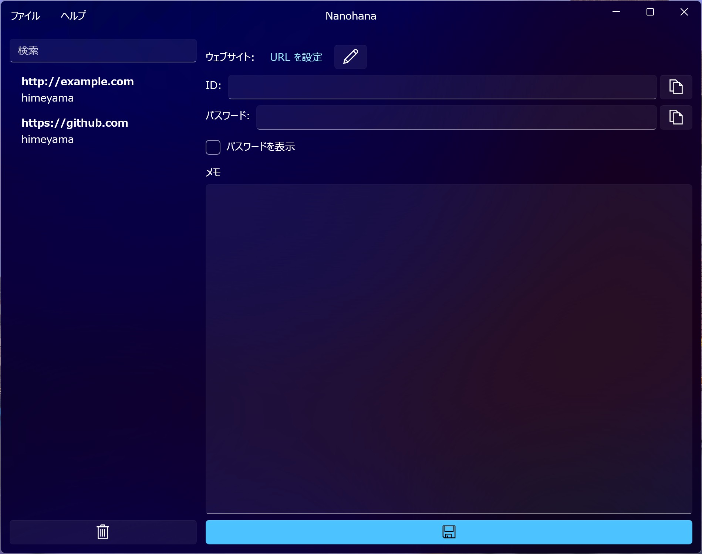
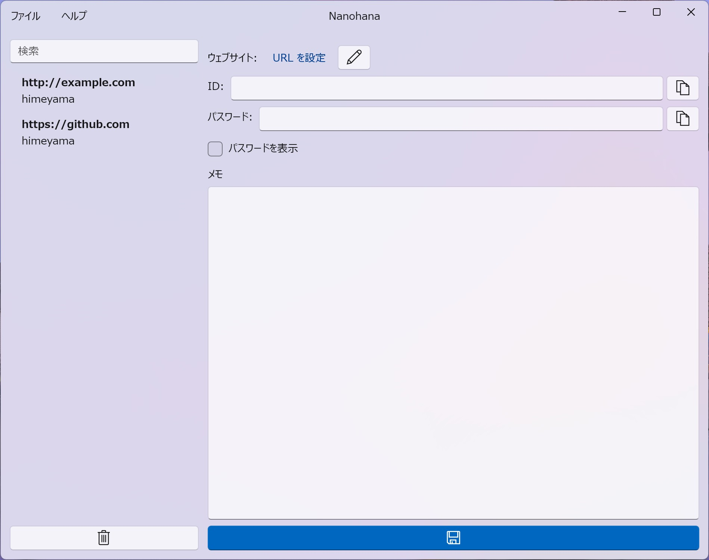

# Nanohana
[日本語](README.md) | English

Password management tool Nanohana

|Dark|Light|
|:--:|:--:|
|||

Data is stored in the `.nanohana` (hidden directory) under the Documents folder. If the Documents folder is shared via OneDrive, it will be synchronized between PCs.